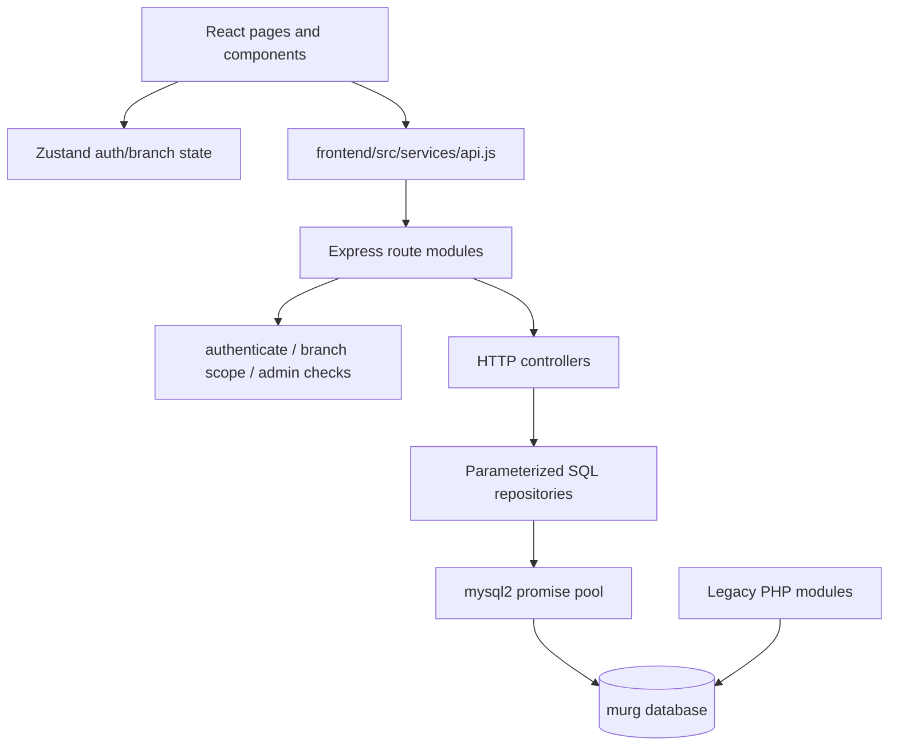

# Current Architecture

## Layers

### Frontend

`frontend/src/main.jsx` mounts the app. `frontend/src/App.jsx` defines React Router routes and `ProtectedRoute`. Axios uses `/api` as its base URL and attaches `localStorage.murg_token` as a bearer token. `useAuthStore` owns login/logout/user state; `useBranchStore` owns the selected branch.

### Backend

`backend/server.js` starts Express from `backend/src/app.js`. `app.js` installs Helmet, CORS, Morgan, JSON parsing, a health endpoint, route modules, a JSON 404 handler, and the centralized error handler. Repositories contain SQL and transaction work; controllers translate requests to repository calls.

### Database

`backend/src/config/database.js` uses a mysql2 promise pool with a 20-connection limit and `timezone: '+01:00'` for Africa/Lagos. Numeric legacy columns remain strings in several tables, so repositories explicitly parse or cast values where required.

## Development Gateway

`npm run dev` executes `scripts/dev-orchestrator.js`. It checks MySQL, detects or starts Apache when possible, runs the database pre-flight check, then starts backend port `5000` and Vite port `5173` concurrently. Vite proxies `/api` to Node and legacy paths to Apache.

## Real-Time Updates

`backend/src/services/realtimeService.js` is an in-process EventEmitter. Branch operation events are published after selected mutations and exposed through an authenticated Server-Sent Events-style route at `/api/realtime/branch`. This is process-local; it is not a shared broker or durable event store.

## Response Convention

Successful API responses use `{ success: true, message, data }`. Errors use `{ success: false, message, errors? }`. Common statuses are 400 validation/business error, 401 unauthenticated, 403 unauthorized, 404 missing, 409 conflict, and 500 server error.
