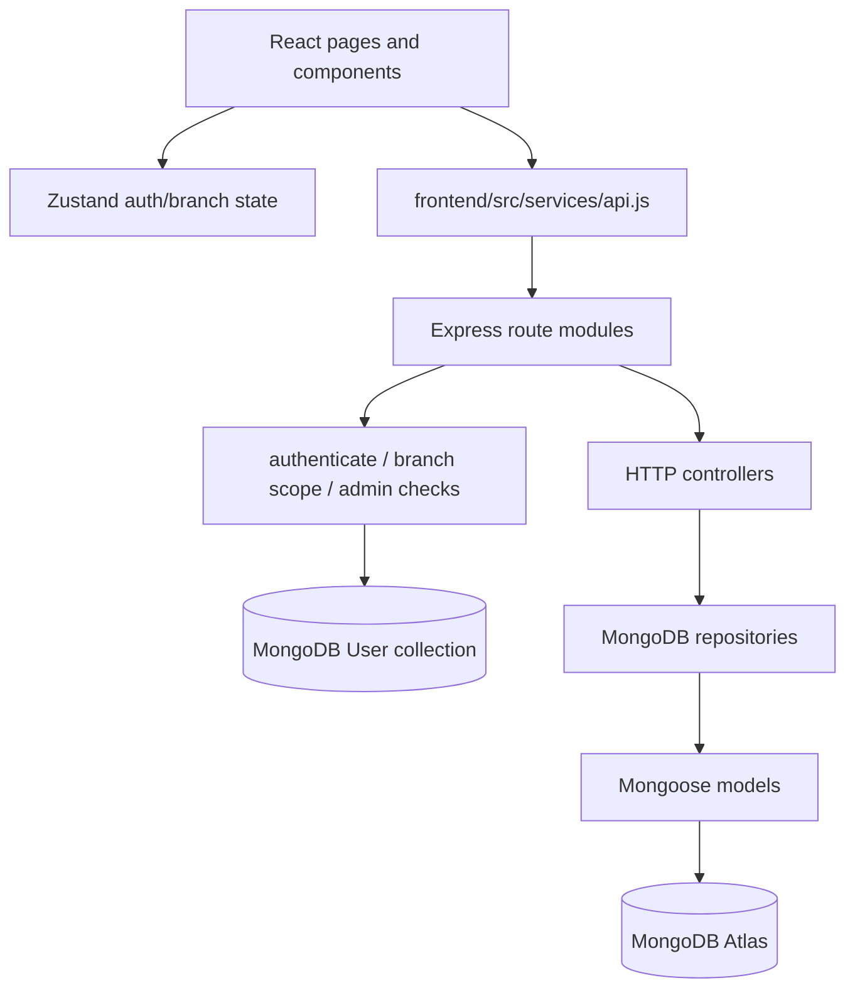

# Current Architecture

## Layers

```mermaid
flowchart TD
  UI[React pages and components] --> Store[Zustand auth/branch state]
  UI --> Client[frontend/src/services/api.js]
  Client --> Routes[Express route modules]
  Routes --> Middleware[authenticate / branch scope / admin checks]
  Routes --> Controllers[HTTP controllers]
  Middleware --> MongoUser[(MongoDB User collection)]
  Controllers --> MongoRepos[MongoDB repositories]
  MongoRepos --> Models[Mongoose models]
  Models --> Atlas[(MongoDB Atlas)]
```

All active Express controllers use MongoDB repositories and Mongoose models. SQL-backed repository files and MySQL scripts remain as inactive migration/history tooling; they are not imported by the application runtime. Do not invoke those legacy SQL tests or scripts as part of normal development.

### Frontend

`frontend/src/main.jsx` mounts the app. `frontend/src/App.jsx` defines React Router routes and `ProtectedRoute`. Axios uses `/api` as its base URL and attaches `localStorage.murg_token` as a bearer token. `useAuthStore` owns login/logout/user state; `useBranchStore` owns the selected branch.

**Routing Behavior:**
- Direct URL navigation works correctly for all routes
- `/login` renders Login page unless already authenticated
- Refresh on authenticated routes preserves session
- Unknown routes render 404 page instead of redirecting to dashboard
- Role-based and admin-only routes are protected at the route level

**Search Implementation:**
- All search inputs use 400ms debounce to prevent excessive API calls
- Backend search uses case-insensitive MongoDB regex with special character escaping
- Search respects branch scope and user permissions
- Partial matching is supported for products, customers, and catalog searches

**Date Handling:**
- `frontend/src/utils/dateUtils.js` provides safe date formatting utilities
- Invalid dates display as `—` instead of "Invalid Date"
- All date displays use these utilities to prevent rendering errors

### Backend

`backend/server.js` starts Express from `backend/src/app.js`. `app.js` installs Helmet, CORS, Morgan, JSON parsing, request IDs, a health endpoint, route modules, a JSON 404 handler, and the centralized error handler. Controllers delegate persistence to MongoDB repositories.

**Shipment Transaction Strategy:**
- Uses atomic single-document operations with manual rollback
- Stock deductions use atomic `$inc` with optimistic concurrency checks
- Manual rollback reverses stock changes if any step fails
- Prevents partial stock movement (source deducted but destination not received)
- All operations logged in `stock_movements` ledger for auditability

**Notification System:**
- Notifications scoped to user ID, role, or branch using OR logic
- Unread count and notification list backed by same MongoDB records with identical query logic
- Frontend automatically marks visible notifications as read when panel opens
- All notification operations enforce ownership constraints
- Read notifications are preserved in history, not deleted
- Frontend displays distinct loading, error, empty, and success states

### Database

`backend/src/config/mongodb.js` owns the runtime Atlas connection. `backend/src/config/database.js` and `mysql2` are retained only for explicitly invoked migration tooling; active application routes do not import the MySQL pool.

### Authentication

The application uses JWT-based authentication configured in `backend/src/config/auth.js`:

- **JWT Secret**: Configured via `JWT_SECRET` environment variable
- **Session Duration**: Configured via `JWT_EXPIRES_IN` environment variable (default: `200d`)
- **Token Issuance**: Tokens are issued only after successful credential verification
- **Token Validation**: Middleware verifies tokens on each protected request
- **No Pre-authentication**: Tokens are never issued before successful login
- **Logout**: Clearing the token from client storage invalidates the session

The 200-day session duration allows users to remain authenticated for approximately 6.5 months without re-login, balancing convenience with security.

## Integration-Test Safety

`npm test --prefix backend` runs database-free safety, date-boundary, aggregation-contract, and repository-interface checks. MongoDB write integration tests use `MONGODB_TEST_URI` only and refuse to connect unless the resolved database name is exactly `murg_test`. Never use the runtime `MONGODB_URI` for destructive test setup or cleanup.

## Development Gateway

`npm run dev` executes `scripts/dev-orchestrator.js` and starts the backend on port `5000` and Vite on port `5173`. It checks for a configured MongoDB Atlas URI; it does not start MySQL or Apache. Vite proxies `/api` to Node. In production, set `VITE_API_BASE_URL` to the deployed API base ending in `/api`, and set backend `CORS_ORIGIN` to the deployed frontend origin.

**Independent Startup:**
- Frontend: `cd frontend && npm run dev` starts Vite on port 5173 (or next available)
- Backend: `cd backend && npm run dev` starts Express on port 5000
- Both services can run independently without requiring the root orchestrator

## Real-Time Updates

`backend/src/services/realtimeService.js` is an in-process EventEmitter. Branch operation events are published after selected mutations and exposed through an authenticated Server-Sent Events-style route at `/api/realtime/branch`. This is process-local; it is not a shared broker or durable event store.

## Response Convention

Successful API responses use `{ success: true, message, data }`. Errors use `{ success: false, message, errors? }`. Common statuses are 400 validation/business error, 401 unauthenticated, 403 unauthorized, 404 missing, 409 conflict, and 500 server error.
