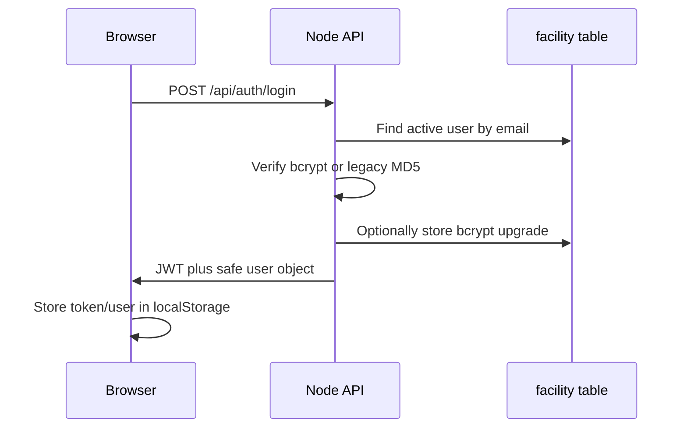

# Authentication

## Login Flow

`POST /api/auth/login` requires email and password. The repository finds the user in `facility`, rejects inactive accounts, and `passwordUtils` supports bcrypt plus legacy MD5 verification. A successful legacy MD5 login may transparently add a bcrypt hash while preserving the legacy column for PHP compatibility. The response never includes passwords or hashes.

The JWT contains the user identity, role, facility/branch code, permissions, and `isGlobalAdmin`. `JWT_EXPIRES_IN` controls lifetime. `authenticate` accepts an `Authorization: Bearer` token and contains a cookie fallback for `token`; the current React client uses the bearer header.

The middleware re-queries `facility` and requires `status = 1` on every authenticated request. `/api/auth/me` returns the current safe user profile.

## Password Reset

1. `POST /api/auth/forgot-password` validates the email shape and returns a generic response whether or not the account exists.
2. A cryptographically random six-digit OTP is SHA-256 hashed and sent through `emailService`.
3. EmailJS is used when configured. In development, an unconfigured provider may use a redacted development log fallback; production requires a real EmailJS provider result.
4. OTP records expire after 10 minutes, have a resend cooldown, and track attempts.
5. `POST /api/auth/verify-reset-otp` returns a single-use reset token after verification.
6. `POST /api/auth/reset-password` validates the token, hashes the new password with bcrypt, preserves the legacy MD5-compatible password column, and marks the reset record used.

The persistence table is `password_resets`. Never log or document OTPs, reset tokens, credentials, or hashes.

## Frontend Protection

`ProtectedRoute` redirects unauthenticated users to `/login`. Admin-only React pages redirect non-admin users to `/`. This is only presentation protection; backend middleware remains the security boundary.
