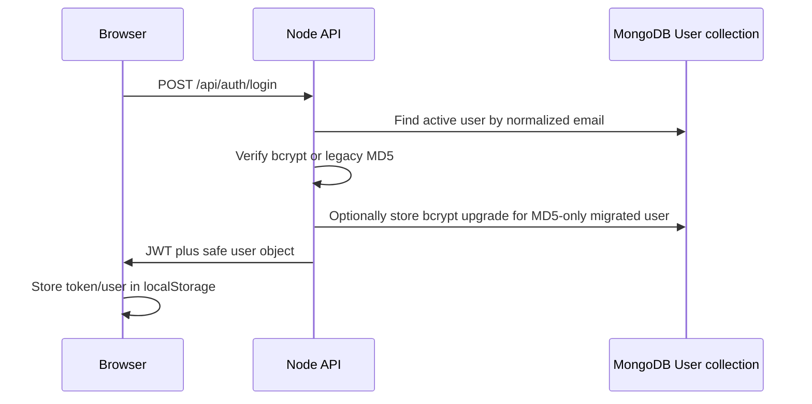

# Authentication

## Login Flow

```mermaid
sequenceDiagram
  participant B as Browser
  participant API as Node API
  participant DB as MongoDB User collection
  B->>API: POST /api/auth/login
  API->>DB: Find active user by normalized email
  API->>API: Verify bcrypt or legacy MD5
  API->>DB: Optionally store bcrypt upgrade for MD5-only migrated user
  API->>B: JWT plus safe user object
  B->>B: Store token/user in localStorage
```

`POST /api/auth/login` requires email and password. `authRepositoryMongo` finds the user in MongoDB, rejects inactive accounts, and `passwordUtils` checks bcrypt hashes plus strict legacy MD5 hashes for migrated users that still need compatibility. A successful MD5 match may transparently add a bcrypt hash. No PHP session or MySQL lookup is part of authentication. The response never includes passwords or hashes.

The JWT `sub` is the Mongo ObjectId and also contains role, facility/branch code, permissions, and `isGlobalAdmin`. `JWT_EXPIRES_IN` controls lifetime. `authenticate` verifies the signature and re-queries the active Mongo user on each request. `GET /api/auth/me` is the session restoration check.

The Zustand store persists the JWT in localStorage and validates it through `/api/auth/me` before protected routes render. Invalid/expired tokens are cleared; transient network/server errors preserve the token and show a retry state. Login failures do not clear a pre-existing token. Logout explicitly clears auth storage and state.

## Password Reset

1. `POST /api/auth/forgot-password` validates the email shape and returns a generic response whether or not the account exists.
2. A cryptographically random six-digit OTP is SHA-256 hashed and sent through `emailService`.
3. EmailJS is used when configured. In development, an unconfigured provider may use a redacted development log fallback; production requires a real EmailJS provider result.
4. OTP records expire after 10 minutes, have a resend cooldown, and track attempts.
5. `POST /api/auth/verify-reset-otp` returns a single-use reset token after verification.
6. `POST /api/auth/reset-password` validates the token, hashes the new password with bcrypt, updates the migrated user document, and marks the reset record used.

The persistence table is `password_resets`. Never log or document OTPs, reset tokens, credentials, or hashes.

## Frontend Protection

`ProtectedRoute` redirects unauthenticated users to `/login`. Admin-only React pages redirect non-admin users to `/`. This is only presentation protection; backend middleware remains the security boundary.
