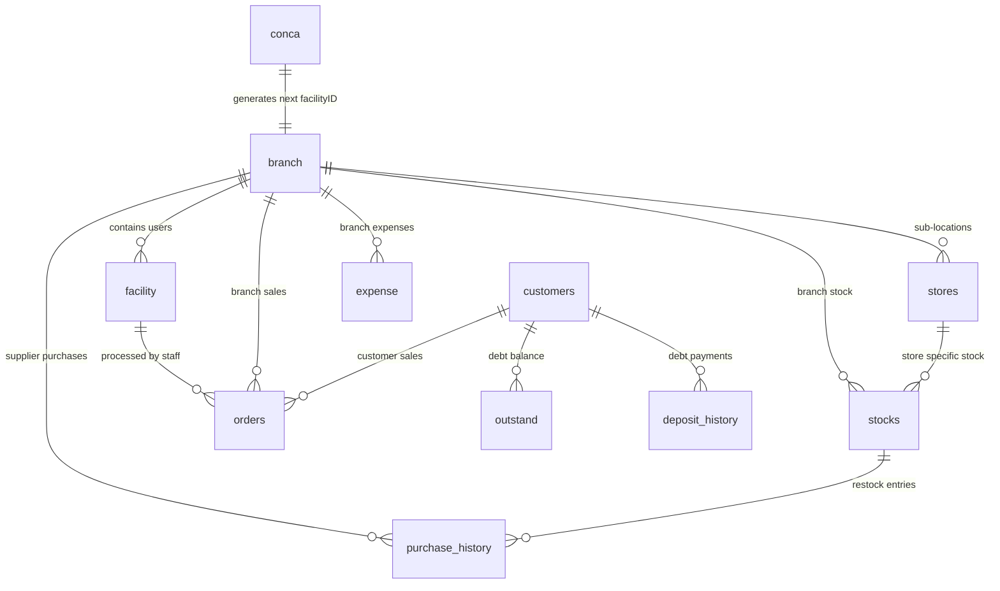

# MURG Database Schema & Data Architecture

## 1. Database Specifications

* **Database Engine**: MariaDB 10.4 / MySQL 8.x
* **Default Collation**: `utf8mb4_general_ci` / `latin1_swedish_ci` (legacy mixed)
* **Default Storage Engine**: InnoDB
* **Database Name**: `murg`
* **Local Connection Method**: `mysqli` via `assets/mashaAllah/gyada.php` (PHP) and `mysql2/promise` (Node.js)

---

## 2. Entity-Relationship Overview (Existing Model)



---

## 3. Comprehensive Table Catalog (Existing Production Schema)

### 3.1 `branch`
Stores physical branch locations.
| Column | Type | Null | Default | Description |
|---|---|---|---|---|
| `id` | `int(11)` | NO | Primary Key, Auto Increment | Internal numeric identifier |
| `facilityID` | `varchar(200)` | NO | None | Unique branch code (e.g. `MURG/001`, `MURG/002`) |
| `name` | `varchar(255)` | NO | None | Branch display name (e.g. "Alh Yasir") |
| `address` | `varchar(255)` | YES | NULL | Physical location of the branch |

### 3.2 `facility` (The System Users Table)
Despite the naming convention, the `facility` table serves as the primary **Users and Staff** table.
| Column | Type | Null | Default | Description |
|---|---|---|---|---|
| `id` | `int(11)` | NO | Primary Key, Auto Increment | User ID |
| `facilityID` | `varchar(200)` | NO | None | Branch foreign key code (`branch.facilityID`) |
| `agentID` | `varchar(200)` | YES | NULL | Optional agent reference |
| `name` | `varchar(200)` | NO | None | Staff full name |
| `email` | `varchar(200)` | NO | None | Login email address (unique in practice) |
| `phone` | `varchar(200)` | NO | None | Staff phone contact |
| `gender` | `varchar(200)` | NO | None | Gender ("Male" / "Female") |
| `fname` | `varchar(200)` | NO | None | Branch or company business name |
| `address` | `varchar(200)` | NO | None | Staff home or office address |
| `role` | `varchar(200)` | NO | None | User Role: `Admin`, `Sub-admin` (Manager), `Staff` (Cashier) |
| `status` | `int(11)` | NO | None | Account status: `1` = Active, `0` = Suspended |
| `password` | `varchar(200)` | NO | None | MD5 hash of user password (used by legacy PHP) |
| `password_hash` | `varchar(255)` | YES | NULL | Modern bcrypt hash (used by Node.js, auto-upgraded) |
| `permissions` | `json` | YES | NULL | Optional granular permissions JSON array |
| `creation` | `timestamp` | NO | `current_timestamp()` | Registration timestamp |
| `updation` | `timestamp` | YES | NULL | Last modification timestamp |

### 3.3 `conca`
Maintains the auto-increment counter for generating sequential `facilityID` branch codes.
| Column | Type | Null | Default | Description |
|---|---|---|---|---|
| `id` | `int(11)` | NO | Primary Key | Always 1 |
| `lastID` | `varchar(200)` | NO | None | Last issued branch counter integer (e.g. '1', '2') |

### 3.4 `stores`
Sub-locations or designated warehouse sections belonging to a physical branch (e.g. "RUMFA", "LAYIN KWARI").
| Column | Type | Null | Default | Description |
|---|---|---|---|---|
| `id` | `int(11)` | NO | Primary Key, Auto Increment | Store ID |
| `store_name` | `varchar(255)` | NO | None | Store name |
| `branch_id` | `varchar(200)` | NO | None | Associated branch (`branch.facilityID`) |
| `status` | `enum('active','inactive')` | YES | `'active'` | Store active status |
| `creation` | `timestamp` | NO | `current_timestamp()` | Timestamp |

### 3.5 `stocks`
Inventory master table. Contains individual product inventory records scoped by branch and store.
| Column | Type | Null | Default | Description |
|---|---|---|---|---|
| `id` | `int(11)` | NO | Primary Key, Auto Increment | Stock ID |
| `facilityID` | `varchar(200)` | NO | None | Branch code (`branch.facilityID`) |
| `store_id` | `int(11)` | YES | NULL | Optional sub-store identifier (`stores.id`) |
| `name` | `varchar(200)` | NO | None | Product title (e.g. "LAS VEGAS", "SILVER CROWN") |
| `unit_type` | `enum('belt','yard')`| NO | `'belt'` | Unit of measure |
| `yards_per_belt` | `decimal(10,2)` | YES | NULL | Conversion factor (e.g. 100.00 yards per belt) |
| `parent_stock_id` | `int(11)` | YES | NULL | Link for converted yard stocks to parent belt stock |
| `buying` | `varchar(200)` | NO | None | Unit cost price (stored as string!) |
| `selling` | `varchar(200)` | NO | None | Unit retail price (stored as string!) |
| `quantity` | `varchar(200)` | NO | None | Current physical quantity available (stored as string!) |
| `opening_quantity` | `varchar(200)` | YES | `'0'` | Daily/historical opening stock quantity |
| `closing_quantity` | `varchar(200)` | YES | `'0'` | Daily/historical closing stock quantity |
| `new_order` | `varchar(200)` | YES | `'0'` | Accumulator for newly received stock in current period |
| `out_stocks` | `varchar(200)` | YES | `'0'` | Accumulator for sold/outbound stock in current period |
| `Bsubtotal` | `varchar(200)` | YES | NULL | Buying price $\times$ quantity valuation |
| `Ssubtotal` | `varchar(200)` | YES | NULL | Selling price $\times$ quantity valuation |
| `creation` | `timestamp` | NO | `current_timestamp()` | Created at |
| `updation` | `timestamp` | YES | `current_timestamp()` | Updated at |
| `status` | `varchar(20)` | NO | `'active'` | Status: `active`, `locked`, `archived` |

### 3.6 `orders`
The sales record table. In the legacy design, each row in `orders` represents an individual line item of an order, with order-level fields (`amount_paid`, `net_total`, `cash`, `pos`, `transfer`) repeated across each item row.
| Column | Type | Null | Default | Description |
|---|---|---|---|---|
| `id` | `int(11)` | NO | Primary Key, Auto Increment | Row ID |
| `facilityID` | `varchar(200)` | NO | None | Branch where sale took place |
| `staffID` | `varchar(200)` | NO | None | Staff ID who made the sale |
| `stockID` | `int(11)` | YES | NULL | Link to `stocks.id` |
| `item` | `varchar(200)` | NO | None | Product name at time of sale |
| `price` | `varchar(200)` | NO | None | Unit price charged |
| `quantity` | `varchar(200)` | NO | None | Quantity purchased |
| `subtotal` | `varchar(200)` | NO | None | Line total (`price * quantity`) |
| `item_discount` | `varchar(200)` | YES | `'0'` | Per-item discount granted |
| `staff` | `varchar(200)` | YES | NULL | Staff name |
| `payment` | `varchar(200)` | YES | NULL | Payment method: `Split Payment`, `Credit`, etc. |
| `orderID` | `varchar(200)` | YES | NULL | Common order group identifier (timestamp+random) |
| `discount` | `varchar(200)` | YES | NULL | Global order discount |
| `status` | `int(11)` | NO | None | `1` = Completed/Paid, `0` = Credit/Pending |
| `customerID` | `int(11)` | YES | NULL | Customer reference (`customers.id`) |
| `customer_name` | `varchar(255)` | YES | NULL | Customer name from customers table |
| `buyer_name` | `varchar(255)` | YES | NULL | Direct walk-in buyer name if not registered |
| `amount_paid` | `varchar(200)` | YES | NULL | Total money paid across payment channels |
| `change_given` | `varchar(200)` | YES | NULL | Change returned to buyer |
| `net_total` | `varchar(200)` | YES | NULL | Order total after discounts |
| `bank_name` | `varchar(255)` | YES | NULL | Bank name if transfer payment |
| `cash` | `varchar(200)` | YES | NULL | Cash amount received |
| `pos` | `varchar(200)` | YES | NULL | Card POS amount received |
| `transfer` | `varchar(200)` | YES | NULL | Bank transfer amount received |
| `creation` | `timestamp` | NO | `current_timestamp()` | Transaction timestamp |

### 3.7 `order_items`
A normalized order items table introduced in recent schema updates, storing `orderID`, `stockID`, `item`, `price`, `quantity`, `subtotal`.

### 3.8 `cart` & `debt_cart`
Temporary holding tables for active POS cart sessions before checkout.
* `cart`: Active cash/split POS checkout cart.
* `debt_cart`: Active credit order cart tied to a specific `customerID`.

### 3.9 `customers`
Catalog of registered buyers and wholesale dealers.
| Column | Type | Null | Default | Description |
|---|---|---|---|---|
| `id` | `int(11)` | NO | Primary Key, Auto Increment | Customer ID |
| `facilityID` | `varchar(200)` | NO | None | Branch where customer was registered |
| `name` | `varchar(200)` | NO | None | Full Customer / Business Name |
| `phone` | `varchar(200)` | NO | None | Phone number |
| `email` | `varchar(200)` | NO | None | Email address |
| `gender` | `varchar(200)` | NO | None | Gender |
| `address` | `varchar(200)` | NO | None | Business or residential address |
| `creation` | `timestamp` | NO | `current_timestamp()` | Registration timestamp |

### 3.10 `outstand`
Stores customer credit balances and cumulative deposit amounts.
| Column | Type | Null | Default | Description |
|---|---|---|---|---|
| `id` | `int(11)` | NO | Primary Key, Auto Increment | Row ID |
| `facilityID` | `varchar(200)` | NO | None | Branch code |
| `customerID` | `varchar(200)` | YES | NULL | Customer reference (`customers.id`) |
| `Customer` | `varchar(200)` | NO | None | Customer name cached |
| `amount` | `varchar(200)` | NO | None | Total cumulative payments/deposits made |
| `balance` | `varchar(200)` | NO | None | Remaining outstanding debt balance |

### 3.11 `deposit_history`
Audit log of debt repayment deposits made by credit customers.
| Column | Type | Null | Default | Description |
|---|---|---|---|---|
| `id` | `int(11)` | NO | Primary Key, Auto Increment | Record ID |
| `customerID` | `int(11)` | NO | None | Customer ID |
| `transaction_id` | `varchar(100)` | YES | NULL | e.g. `DP-1711468200-4821` |
| `amount` | `decimal(15,2)` | NO | None | Deposit amount |
| `payment_method` | `varchar(50)` | YES | NULL | Cash, POS, Bank Transfer |
| `previous_balance` | `decimal(15,2)` | NO | None | Balance before payment |
| `new_balance` | `decimal(15,2)` | NO | None | Balance after payment |
| `processed_by` | `varchar(100)` | YES | NULL | Staff name |
| `deposit_date` | `timestamp` | NO | `current_timestamp()` | Date/time |

### 3.12 `purchase_history`
Supplier restock ledger recording incoming inventory.
| Column | Type | Null | Default | Description |
|---|---|---|---|---|
| `id` | `int(11)` | NO | Primary Key, Auto Increment | Record ID |
| `facilityID` | `varchar(200)` | YES | NULL | Branch receiving the stock |
| `stock_id` | `int(11)` | YES | NULL | Stock item ID |
| `initial_quantity` | `int(11)` | YES | 0 | Stock balance prior to receiving |
| `purchaser` | `varchar(255)` | YES | NULL | Staff member who received it |
| `purchase_from` | `varchar(255)` | YES | NULL | Supplier / Dealer name |
| `stock_name` | `varchar(255)` | YES | NULL | Product name |
| `quantity` | `int(11)` | YES | NULL | Quantity received |
| `cost_price` | `decimal(10,2)` | YES | NULL | Unit buying price |
| `total_cost` | `decimal(10,2)` | YES | NULL | Total cost (`cost_price * quantity`) |
| `amount_paid` | `decimal(15,2)` | YES | `0.00` | Amount paid to supplier |
| `balance` | `decimal(15,2)` | YES | `0.00` | Balance owed to supplier |
| `for_desc` | `varchar(255)` | YES | `''` | Notes / batch description |
| `purchase_date` | `datetime` | YES | `current_timestamp()` | Date of receipt |

---

## 4. Critical Database Audit Findings

1. **String Storage for Numbers**:
   Columns like `stocks.quantity`, `stocks.buying`, `stocks.selling`, `orders.price`, `orders.quantity`, and `outstand.balance` are defined as `varchar(200)`. In PHP, loose typing implicitly casts these during arithmetic (`$bought * $quantity`), but in raw SQL or Node.js, `SUM(quantity)` requires `CAST(quantity AS DECIMAL(15,2))` or causes silent string concatenation bugs if not carefully handled.
2. **Missing Branch Scope on `deposit_history`**:
   `deposit_history` does not contain `facilityID`. When a customer pays a debt, the payment record is not associated with the branch where the payment was accepted.
3. **Legacy Zero Records in `purchase_history`**:
   In older records, `facilityID` and `stock_id` were inserted as `0`. Any query relying on `INNER JOIN stocks ON purchase_history.stock_id = stocks.id` silently excludes historical transactions.
4. **Premature Stock Deduction**:
   In `cart.php` and `credit.php`, `stocks.quantity` is decremented as soon as an item is placed in `cart` or `debt_cart`. If a user closes the browser or leaves items in the cart without checking out, inventory remains decremented permanently unless manually deleted.
5. **No Foreign Key Constraints**:
   Tables rely on application-level integrity. Referential actions (`ON DELETE CASCADE`, etc.) are not enforced by InnoDB constraints.

---

## 5. Non-Destructive Schema Additions (Additive Migrations)

To satisfy the new requirements (isolated branches, role permissions, reliable stock movements, supplier receipts, inter-branch shipping, and audit logs), the following **additive tables** and non-breaking column additions will be introduced:

### 5.1 New Table: `stock_movements` (Immutable Inventory Ledger)
```sql
CREATE TABLE IF NOT EXISTS `stock_movements` (
  `id` BIGINT AUTO_INCREMENT PRIMARY KEY,
  `facilityID` VARCHAR(200) NOT NULL,
  `store_id` INT NULL,
  `stock_id` INT NOT NULL,
  `movement_type` ENUM(
    'STOCK_IN_SUPPLIER',
    'STOCK_OUT_SALE',
    'STOCK_IN_RETURN',
    'STOCK_OUT_TRANSFER',
    'STOCK_IN_TRANSFER',
    'STOCK_ADJUSTMENT',
    'STOCK_DAMAGE'
  ) NOT NULL,
  `quantity_change` DECIMAL(15,2) NOT NULL,
  `quantity_before` DECIMAL(15,2) NOT NULL,
  `quantity_after` DECIMAL(15,2) NOT NULL,
  `reference_type` VARCHAR(50) NOT NULL, -- 'orders', 'purchase_history', 'shipments', etc.
  `reference_id` VARCHAR(100) NOT NULL,
  `notes` TEXT NULL,
  `performed_by` INT NOT NULL, -- facility.id
  `created_at` TIMESTAMP DEFAULT CURRENT_TIMESTAMP,
  INDEX `idx_stock_facility` (`stock_id`, `facilityID`),
  INDEX `idx_movement_type` (`movement_type`),
  INDEX `idx_created_at` (`created_at`)
) ENGINE=InnoDB DEFAULT CHARSET=utf8mb4 COLLATE=utf8mb4_general_ci;
```

### 5.2 New Table: `shipments` & `shipment_items` (Inter-Branch Shipping)
```sql
CREATE TABLE IF NOT EXISTS `shipments` (
  `id` INT AUTO_INCREMENT PRIMARY KEY,
  `tracking_number` VARCHAR(50) NOT NULL UNIQUE,
  `source_branch` VARCHAR(200) NOT NULL,
  `destination_branch` VARCHAR(200) NOT NULL,
  `source_store_id` INT NULL,
  `destination_store_id` INT NULL,
  `status` ENUM('Draft', 'Pending', 'In Transit', 'Received', 'Cancelled') NOT NULL DEFAULT 'Draft',
  `dispatched_by` INT NULL, -- facility.id
  `dispatched_at` DATETIME NULL,
  `received_by` INT NULL, -- facility.id
  `received_at` DATETIME NULL,
  `notes` TEXT NULL,
  `created_by` INT NOT NULL,
  `created_at` TIMESTAMP DEFAULT CURRENT_TIMESTAMP,
  INDEX `idx_source_dest` (`source_branch`, `destination_branch`),
  INDEX `idx_status` (`status`)
) ENGINE=InnoDB DEFAULT CHARSET=utf8mb4 COLLATE=utf8mb4_general_ci;

CREATE TABLE IF NOT EXISTS `shipment_items` (
  `id` INT AUTO_INCREMENT PRIMARY KEY,
  `shipment_id` INT NOT NULL,
  `stock_id` INT NOT NULL,
  `product_name` VARCHAR(255) NOT NULL,
  `quantity_sent` DECIMAL(15,2) NOT NULL,
  `quantity_received` DECIMAL(15,2) DEFAULT 0,
  FOREIGN KEY (`shipment_id`) REFERENCES `shipments`(`id`) ON DELETE CASCADE
) ENGINE=InnoDB DEFAULT CHARSET=utf8mb4 COLLATE=utf8mb4_general_ci;
```

### 5.3 New Table: `audit_logs` (Security & Sensitive Operations)
```sql
CREATE TABLE IF NOT EXISTS `audit_logs` (
  `id` BIGINT AUTO_INCREMENT PRIMARY KEY,
  `facilityID` VARCHAR(200) NULL,
  `user_id` INT NOT NULL,
  `user_name` VARCHAR(200) NOT NULL,
  `action` VARCHAR(100) NOT NULL, -- 'PRICE_CHANGE', 'STOCK_ADJUST', 'STAFF_ROLE_CHANGE', etc.
  `entity_type` VARCHAR(50) NOT NULL, -- 'stocks', 'facility', 'branch', etc.
  `entity_id` VARCHAR(100) NOT NULL,
  `old_values` JSON NULL,
  `new_values` JSON NULL,
  `ip_address` VARCHAR(45) NULL,
  `user_agent` TEXT NULL,
  `created_at` TIMESTAMP DEFAULT CURRENT_TIMESTAMP,
  INDEX `idx_audit_action` (`action`),
  INDEX `idx_audit_user` (`user_id`),
  INDEX `idx_audit_entity` (`entity_type`, `entity_id`)
) ENGINE=InnoDB DEFAULT CHARSET=utf8mb4 COLLATE=utf8mb4_general_ci;
```

### 5.4 Non-Destructive Column Additions to Existing Tables
1. `ALTER TABLE deposit_history ADD COLUMN facilityID VARCHAR(200) NULL AFTER customerID;`
2. `ALTER TABLE branch ADD COLUMN status ENUM('active','inactive') DEFAULT 'active' AFTER address;`
3. `ALTER TABLE branch ADD COLUMN phone VARCHAR(50) NULL AFTER address;`
4. `ALTER TABLE facility ADD COLUMN password_hash VARCHAR(255) NULL AFTER password;` (for bcrypt upgrade)
5. `ALTER TABLE facility ADD COLUMN permissions JSON NULL AFTER role;`
