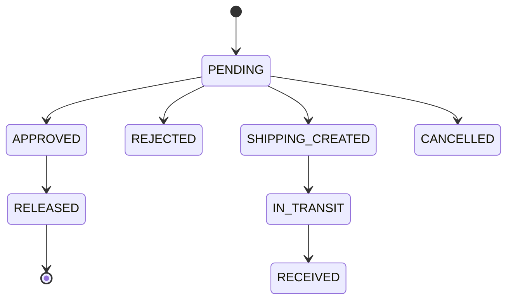

# Goods Requests and Release Receipts

## State Machine

The current workflow is centered on `goods_requests.status`:

Older shipment-related statuses remain in the enum for backward compatibility.

## Workflow

1. Authenticated staff submits `POST /api/goods-requests`. Identity and requesting branch come from JWT. Catalog and custom product requests are supported.
2. Admin lists requests, checks eligible source branches/stock, then approves or rejects. Approval stores source branch/stock and creates an approval `receipt_code`; approval does not deduct source stock.
3. Source-branch staff looks up/verifies the code. The backend checks the authenticated source branch, not a client-supplied branch.
4. Release atomically validates the approved request, deducts source stock, records release identity/time, and creates a final `collection_code`.
5. Notifications and branch events inform relevant users.

`approve-and-ship` remains as a backward-compatible admin endpoint for older records and calls the legacy compatibility path.

## Authorization

Admins can view and process all requests. Non-admin users see their own/branch-authorized requests; source staff can see approved requests pending release at their branch. Receipt code lookup and release reject unauthorized or already-consumed codes.

## Source of Truth

Request lifecycle: `goods_requests`. Approval/release receipt record: `shipment_receipts` plus request receipt fields. Inventory effect: `stocks` and `stock_movements`. User notification: `notifications`.
