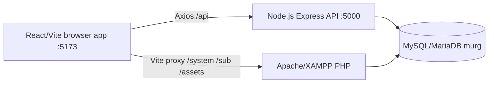

# Project Overview

## What MURG Is

MURG Textile Enterprises is a multi-branch textile business management application. It supports point-of-sale sales, credit/debt sales, branch inventory, stock movements, supplier receiving, inter-branch shipments, goods requests, customer deposits, staff/branch administration, receipts, and operational analytics.

## Current Runtime

React and PHP are a coexistence system over one database. The application is being migrated incrementally; a module is not considered migrated merely because a React page exists. The migration map in [LEGACY_PHP_AND_MIGRATION.md](LEGACY_PHP_AND_MIGRATION.md) is the operational boundary.

## Stack Verified From Package Files

- Frontend: React `19.2.8`, Vite `8.3.0`, React Router `7.18.4`, Zustand `5.0.15`, Axios `1.20.0`, Tailwind CSS `4.3.3`, Lucide React, Motion.
- Backend: Node.js CommonJS application, Express `5.2.1`, mysql2 `3.24.4`, JSON Web Token `9.0.3`, bcryptjs `3.0.3`, Helmet, CORS, Morgan, express-validator.
- Legacy: PHP under Apache/XAMPP, Bootstrap/jQuery and the existing PHP mail/utility code.
- Database: MySQL/MariaDB-compatible database named `murg`; the repository does not pin a server version.

## Business Boundaries

- `facility` is the user/staff table despite its legacy name.
- `facilityID` is the branch code used throughout the application.
- `orders` stores sale line rows grouped by `orderID`.
- `stocks` stores current inventory state; `stock_movements` stores historical inventory events.
- `outstand` and customer/deposit tables represent debt balances and payments.
- `shipment*` and `goods_requests` represent transfers and requests, not sales.

## Do Not Recreate

Do not create another login system, POS calculation path, inventory ledger, receipt system, goods-request workflow, branch authorization layer, or DAS/WAS/MAS calculation in the frontend. Locate and extend the existing route/controller/repository/page first.
